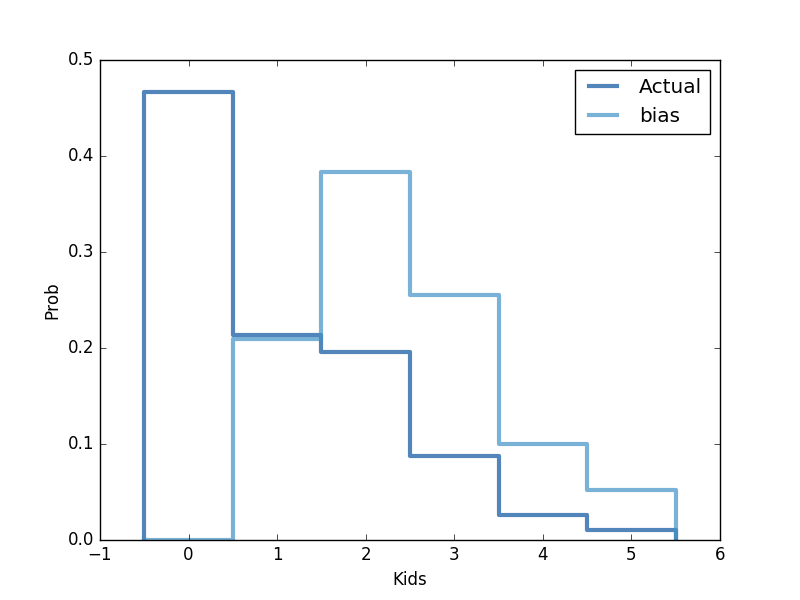

[Think Stats Chapter 3 Exercise 1](http://greenteapress.com/thinkstats2/html/thinkstats2004.html#toc31) (actual vs. biased)

>> REPLACE THIS TEXT WITH YOUR RESPONSE
#Use the NSFG respondent variable NUMKDHH to construct the actual distribution for #the number of children under 18 in the household.

'import nsfg'
'import thinkstats2'
'import thinkplot'

I first create data frame from ReadFemResp function, then create a distribution out of column 'numkdhh'. Finally I create a Pmf object out of the distribution using Pmf() function from thinkstats2 module.

data = nsfg.ReadFemResp()
data18 = data.numkdhh
pmf18 = thinkstats2.Pmf(data18, label = 'Actual')

#Now compute the biased distribution we would see if we surveyed the children and #asked them how many children under 18 (including themselves) are in their household.

Code for function that takes Pmf and returns Bias Pmf
~~~
def BiasPmf(pmf, label):
     new_pmf = pmf.Copy(label=label)
     for x, p in pmf.Items():
             new_pmf.Mult(x, x)
     new_pmf.Normalize()
     return new_pmf

bias = BiasPmf(pmf18, label = 'Bias')

~~~

#Plot the actual and biased distributions:

~~~
thinkplot.PrePlot(2)
thinkplot.Pmfs([pmf18, bias])
thinkplot.Config(xlabel='Kids',  ylabel='Prob')
thinkplot.Show()
~~~

#and compute their means.

`pmf18.Mean()`
1.02

`bias.Mean()`
2.40
